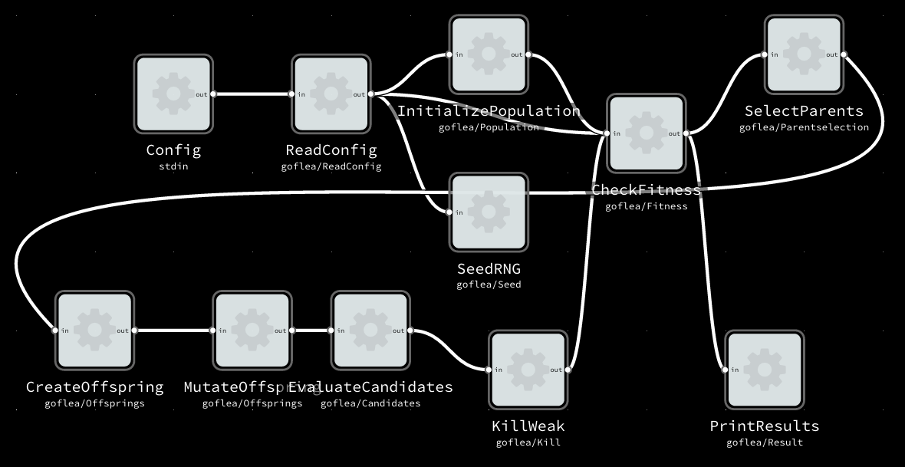

# Go(-flow) based implementation of a simple evolutionary algorithm

## FBP definition
```
Config(stdin) OUT -> IN ReadConfig(goflea/ReadConfig)
ReadConfig(goflea/ReadConfig) OUT -> IN SeedRNG(goflea/Seed)
ReadConfig(goflea/ReadConfig) OUT -> IN CheckFitness(goflea/Fitness)
ReadConfig(goflea/ReadConfig) OUT -> IN InitializePopulation(goflea/Population)
InitializePopulation(goflea/Population) OUT -> IN CheckFitness(goflea/Fitness)
CheckFitness(goflea/Fitness) OUT -> IN PrintResults(goflea/Result)
CheckFitness(goflea/Fitness) OUT -> IN SelectParents(goflea/Parents)
SelectParents(goflea/Parentselection) OUT -> IN CreateOffspring(goflea/Offsprings)
CreateOffspring(goflea/Offsprings) OUT -> IN MutateOffspring(goflea/Offsprings)
MutateOffspring(goflea/Offsprings) OUT -> IN EvaluateCandidates(goflea/Candidates)
EvaluateCandidates(goflea/Candidates) OUT -> IN KillWeak(goflea/Kill)
KillWeak(goflea/Kill) OUT -> IN CheckFitness(goflea/Fitness)
```

## FBP diagram


